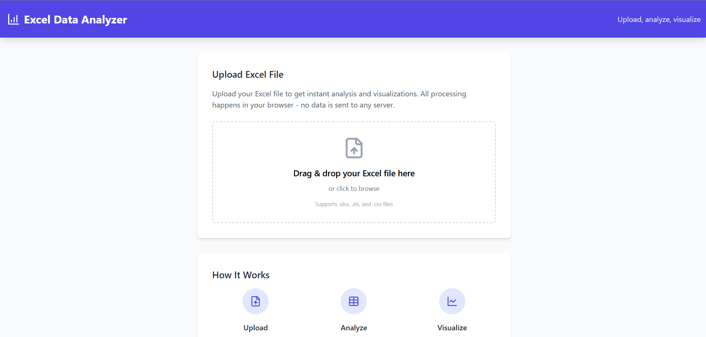
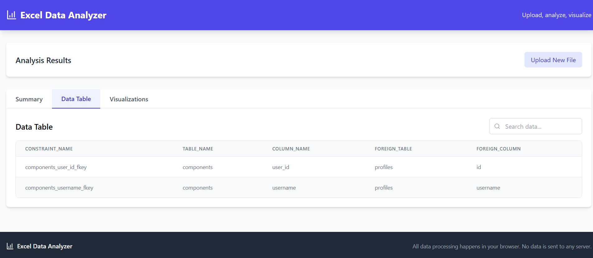
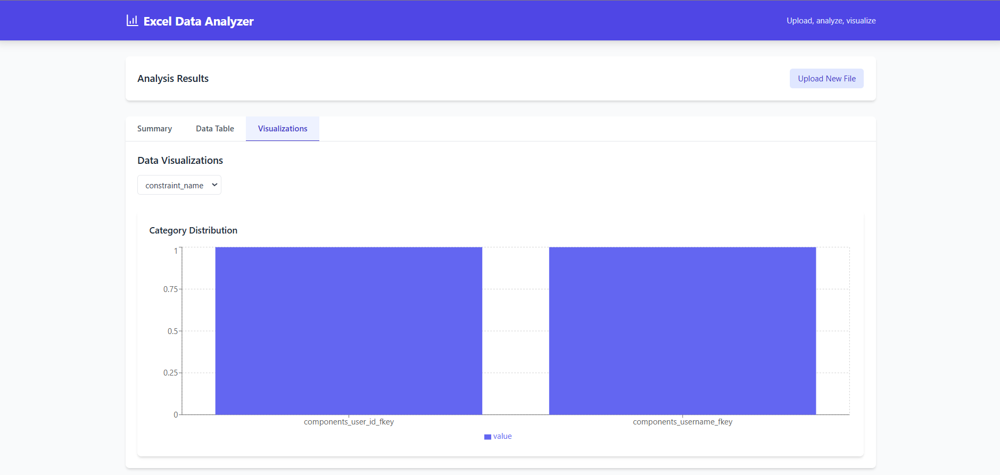

# Excel Data Analyzer

A powerful web-based Excel file analyzer that provides instant data analysis and beautiful visualizations. Process your Excel files directly in the browser with no server uploads required.

[](https://data-analyser-pro.netlify.app/)
*Landing page with drag-and-drop Excel file upload*

[](https://data-analyser-pro.netlify.app/)
*Interactive data analysis dashboard with column statistics and summary view*

[](https://data-analyser-pro.netlify.app/)
*Dynamic charts and visualizations for both categorical and numerical data*

[Try Live Demo](https://data-analyser-pro.netlify.app/)

## Features

- 📊 **Instant Data Analysis**: Upload Excel files (.xlsx, .xls, .csv) and get immediate insights
- 🔒 **Privacy First**: All processing happens in your browser - no data is sent to any server
- 📈 **Rich Visualizations**: 
  - Bar charts for categorical data
  - Line charts for numerical distributions
  - Summary statistics (min, max, mean, median)
- 📱 **Responsive Design**: Works seamlessly on desktop and mobile devices
- 🎨 **Modern UI**: Clean, intuitive interface built with Tailwind CSS
- 📑 **Data Table View**: Browse and search through your data in a paginated table
- 📊 **Column Statistics**: Get detailed statistics for each column in your dataset

## Tech Stack

- React 18
- TypeScript
- Vite
- Tailwind CSS
- Recharts for data visualization
- XLSX for Excel file processing
- Papa Parse for CSV handling

## Installation

1. Clone the repository:
```bash
git clone https://github.com/yourusername/excel-data-analyzer.git
cd excel-data-analyzer
```

2. Navigate to the project directory:
```bash
cd project
```

3. Install dependencies:
```bash
npm install
```

4. Start the development server:
```bash
npm run dev
```

5. Build for production:
```bash
npm run build
```

## Project Structure

```
project/
├── src/
│   ├── components/      # React components
│   ├── utils/          # Utility functions
│   ├── types.ts        # TypeScript type definitions
│   └── App.tsx         # Main application component
├── public/             # Static assets
└── dist/              # Production build output
```

## Dependencies

Main dependencies include:
- `react`: ^18.3.1
- `react-dom`: ^18.3.1
- `xlsx`: ^0.18.5
- `recharts`: ^2.12.2
- `papaparse`: ^5.4.1
- `lucide-react`: ^0.344.0

Dev dependencies:
- `typescript`: ^5.5.3
- `vite`: ^5.4.2
- `tailwindcss`: ^3.4.1
- `eslint`: ^9.9.1

For a complete list, see `package.json`.

## Contributing

Contributions are welcome! Please follow these steps:

1. Fork the repository
2. Create a new branch: `git checkout -b feature/your-feature-name`
3. Make your changes
4. Run tests and linting: `npm run lint`
5. Commit your changes: `git commit -m 'Add some feature'`
6. Push to the branch: `git push origin feature/your-feature-name`
7. Submit a pull request

### Pull Request Guidelines

- Ensure your code follows the existing style
- Include comments where necessary
- Update documentation if you introduce new features
- Add tests if applicable
- Verify all tests pass before submitting

## License

This project is licensed under the MIT License - see the LICENSE file for details.

## Acknowledgments

- Built with [Vite](https://vitejs.dev/)
- UI components styled with [Tailwind CSS](https://tailwindcss.com/)
- Charts powered by [Recharts](https://recharts.org/)

## Support

If you encounter any issues or have questions, please [open an issue](https://github.com/yourusername/excel-data-analyzer/issues) on GitHub.
